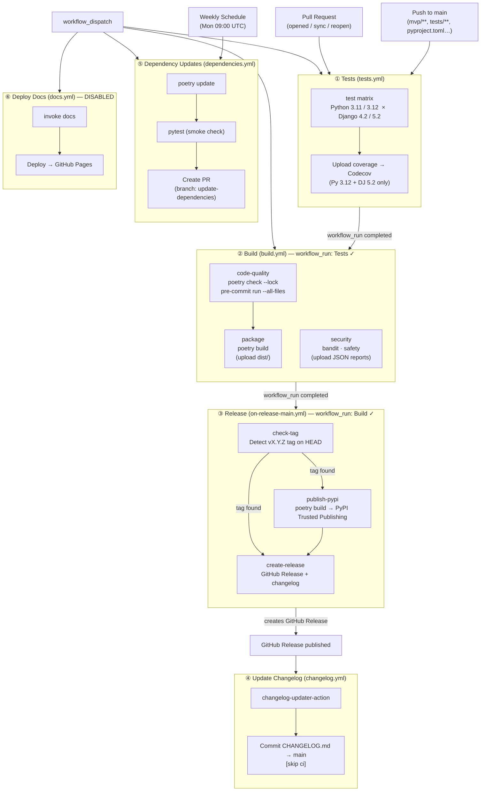

# CI/CD Workflows

This project uses six GitHub Actions workflows, chained into a linear release pipeline with two independent supporting workflows.

## Workflow Overview

| Workflow | File | Trigger |
|---|---|---|
| **Tests** | `tests.yml` | Push/PR to `main` (path-filtered), `workflow_dispatch` |
| **Build** | `build.yml` | `Tests` completes on `main`, `workflow_dispatch` |
| **Release** | `on-release-main.yml` | `Build` completes on `main` |
| **Update Changelog** | `changelog.yml` | GitHub Release published |
| **Dependency Updates** | `dependencies.yml` | Weekly schedule (Mon 09:00 UTC), `workflow_dispatch` |
| **Deploy Docs** | `docs.yml` | `workflow_dispatch` only *(disabled — docs not yet configured)* |

---

## Pipeline Diagram

---

## Job Details

### ① Tests

Runs a 2×2 matrix (Python 3.11/3.12 × Django 4.2/5.2) with `fail-fast: false` so all cells complete even if one fails. Coverage is only collected for the Python 3.12 / Django 5.2 cell and uploaded to Codecov.

Django version pinning is done via `pip install "django~=X.Y"` inside the Poetry virtual environment so the dependency matrix can be varied without maintaining separate lock files.

### ② Build

Three independent jobs:

- **code-quality** — only runs when Tests passed (or on `workflow_dispatch`). Runs `poetry check --lock` to verify the lockfile is consistent, then `pre-commit run --all-files`. If pre-commit modifies any file the step exits non-zero and the job fails — fixes must be committed locally, not auto-applied by CI.
- **security** — runs `bandit` and `safety` via plain `pip install` (not `poetry add`) to avoid mutating the lockfile. Both tools upload JSON reports as artifacts even on failure, and errors are intentionally soft (`|| true`) so they inform without blocking.
- **package** — depends on `code-quality`; builds the wheel/sdist and uploads `dist/` as an artifact for downstream inspection.

### ③ Release

Triggered only when Build succeeds on `main`. The `check-tag` job inspects the HEAD commit for a `v`-prefixed git tag (created by `invoke release --rule=<patch|minor|major>`). If no tag is found, the remaining jobs are skipped — this is the normal path for non-release pushes.

When a tag is found:

1. **publish-pypi** — builds the package (`pyproject.toml` already has the correct version, bumped locally by `invoke release`) and publishes via PyPI Trusted Publishing (no API token required, `id-token: write` permission only).
2. **create-release** — generates a changelog via `mikepenz/release-changelog-builder-action` and creates the GitHub Release using `softprops/action-gh-release@v2`.

### ④ Update Changelog

Fires on the `release: published` event (emitted by step ③). Updates `CHANGELOG.md` with the release notes and commits directly to `main` with `[skip ci]` to avoid re-triggering the pipeline.

### ⑤ Dependency Updates

Runs weekly. Calls `poetry update` (which also regenerates `poetry.lock`), runs the test suite as a smoke check, then opens or updates a PR on branch `update-dependencies`. The PR must be reviewed and merged manually.

### ⑥ Deploy Docs *(disabled)*

The workflow exists but is gated behind `workflow_dispatch` with a dummy `_disabled` input. It will be re-enabled once `invoke docs` and the MkDocs configuration are set up.

---

## Design Decisions

| Decision | Rationale |
|---|---|
| No auto-commit of pre-commit fixes | Auto-committing back to `main` means the release pipeline would build from different code than what was tested. Fixes belong in developer commits. |
| `pip install` for bandit/safety | `poetry add` re-solves the full dependency graph and mutates `pyproject.toml` in CI — non-reproducible and slow. These tools are CI-only utilities, not project dependencies. |
| Redundant `poetry lock` removed from dependencies.yml | `poetry update` already regenerates the lockfile; a second `poetry lock` was a no-op. |
| `poetry version` removed from publish-pypi | `invoke release` bumps the version locally and commits `pyproject.toml` before tagging. The workflow just runs `poetry build` against the already-correct version. |
| `softprops/action-gh-release@v2` over `actions/create-release@v1` | The official action was deprecated and archived; `softprops/action-gh-release` is the community-maintained replacement. |
| `concurrency` on Tests and Build | Prevents stale runs queuing up when commits arrive quickly; older runs are cancelled in favour of the latest. |
| `timeout-minutes` on all jobs | Prevents hung jobs (e.g. a network-blocked hook) from consuming runner minutes for up to the default 6-hour limit. |
